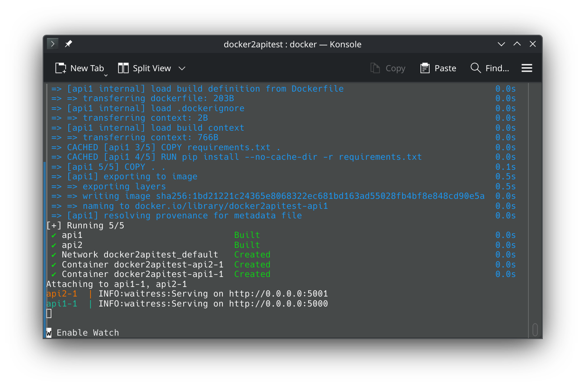
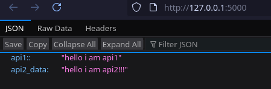
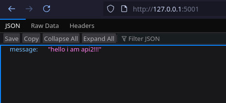

<div align="center">

### **วิธีการ deploy**

</div>

**1.download repo**

````
git clone https://github.com/Thanick50/dockerapi1--api2_test
````

**2.เข้าไปในfolder ของrepo**

````
cd dockerapi1--api2_test
````

**3.สร้างและdeploy api ทั้งสองตัว**

````
docker compose up --build
````
จะสามารถสังเกตุได้ว่า api ทั้งสอง deploy สำเร็จและรันอยู่ที่ port 5000(api1), 5001(api2)



<div align="center">

### **วิธีการ ทดสอบ**

</div>

**ทดสอบ api1**



[go to api1](http://127.0.0.1:5000 "api1 port 5000") (you need to run docker first!!!!!)


<br><br>
**ทดสอบ api2**



[go to api2](http://127.0.0.1:5001 "api2 port 5001") (you need to run docker first!!!!!)
